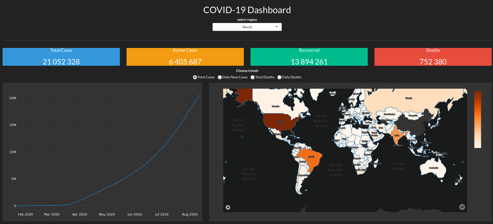

## COVID-19 Dashboard
[COVID-19 Dashboard](https://covidglobal-dash.herokuapp.com/) made with Shiny.  

  
### Data Sources:
  - [CSSE Johns Hopkins](https://github.com/CSSEGISandData/COVID-19)
  - [Worldometer](https://www.worldometers.info/coronavirus/)

### frontend
- 'darkly' theme.
- plotly for graphs
- mapbox/plotly for map

### backend
- deployed with Heroku, 
- data is updated once everyday at 11.30pm UTC+0
    - scraping and cleaning scheduled with Heroku Scheduler.
    - The data is automatically updated using the github api.

